# Web Hitech

## Permissions

There are many permissions such as:

* Create post (a)
* Delete post (b)
* Update post (c)
* Approve post (d)
* Order goods (e)
* Chat with guests (f)
* Chat with staff/admin (g)
* Seclect post (h)
* Search for goods (i)
* Change staff (j)
* Create Staff (k)
* Delete Staff (l)
* Update Staff (m)
* View revenue reports, system activities (n)
* Cancel order (o)
* Update order (p)
* Update Staff (q)
* Comment/vote post (r)

## ROLE

There are 3 roles currently:

1. STAFF (a, b, c, d, f, h, i)
2. ADMIN (All Staff permission + j, k, l, m, n, q)
3. USER (e, f, h, i, o, p, r)

## Entity

There are currently the following entities:

* User
* Goods (Goods vs OrderItem Different ????)
* Role
* Permission
* Voucher
* Address
* InfoBuy (Information about Items)
* OrderItem
* InvalidatedToken
* Review

## Query Test

1. Login
* Input:
  + Right Login: 
* Output:
  + Wrong Login: 
2. Create User
* Input: 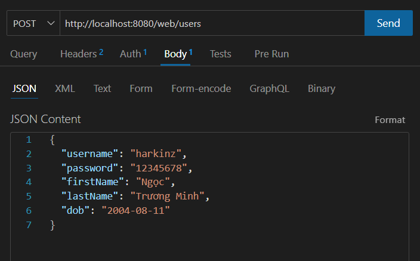
* Output:
  + Dont have Account: 
  + Account Existed: 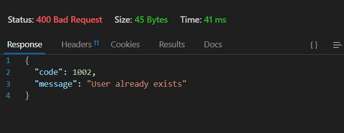
3. Update User
* Input: 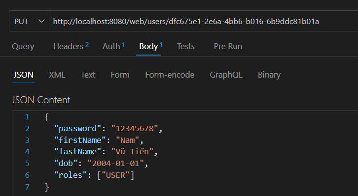
* Output: 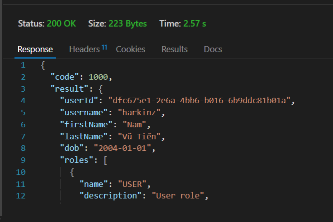
4. Find 1 User
* Input: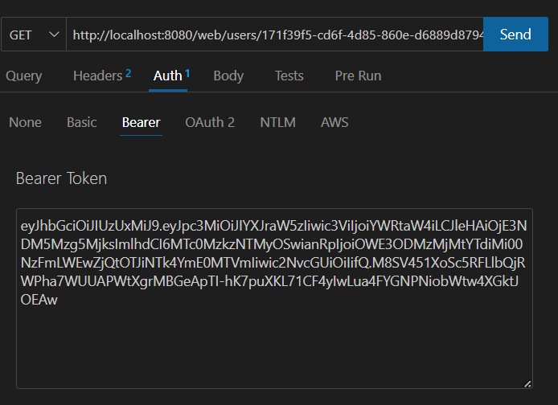
* Output:
5. Get All Users 
* Input: 
* Output:
6. Create Role 
* Input: 
* Output:
7. Get All Roles
* Input: 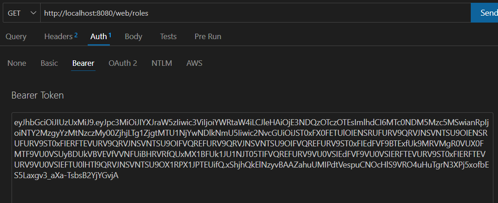
* Output: 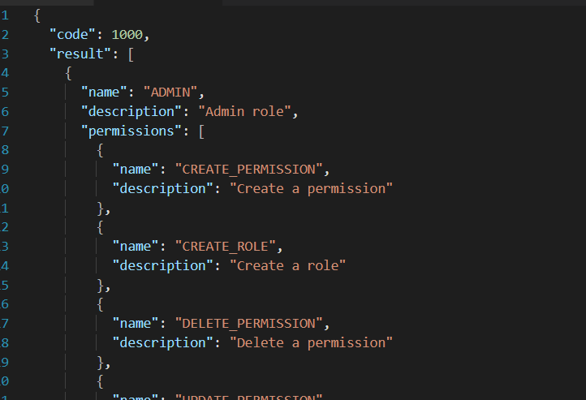 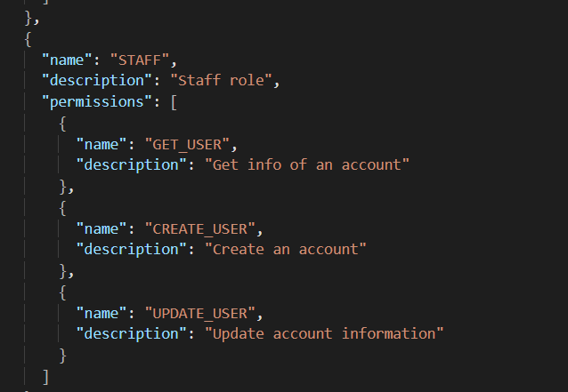 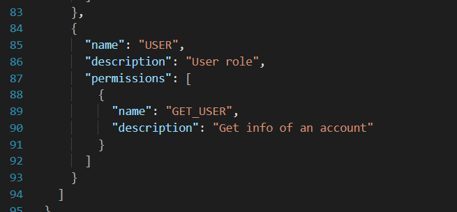
8. Delete Role
* Input:
* Output: 
9. Create Permission
* Input:
* Output:
  + New permission: 
  + Permission existed: 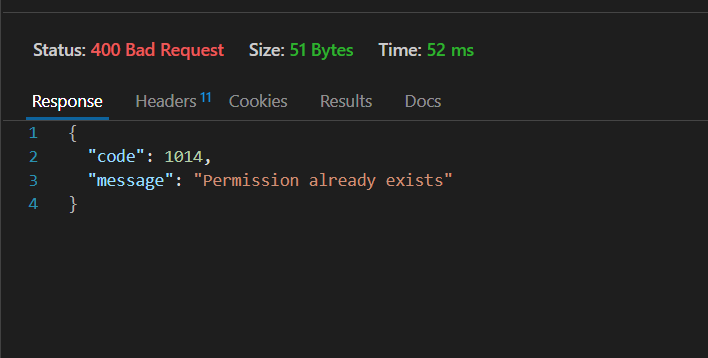
10. Get All Permissions
* Input: 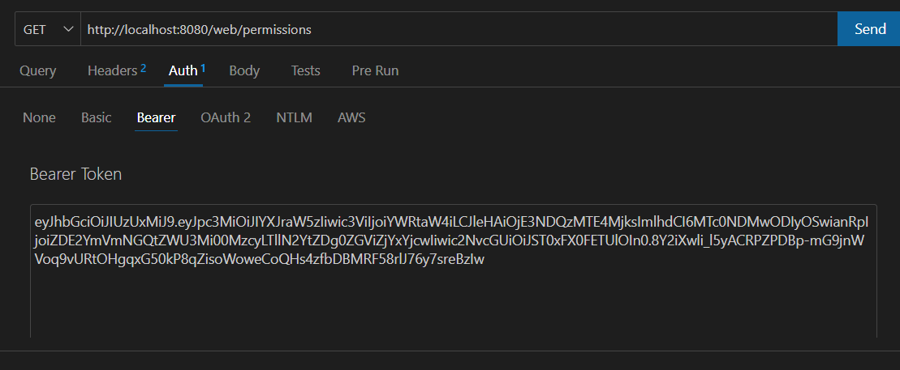
* Output: 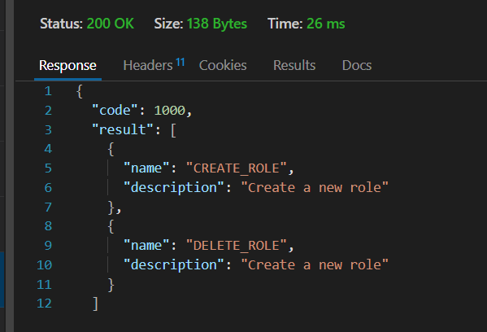
11. Delete Permissions
* Input: 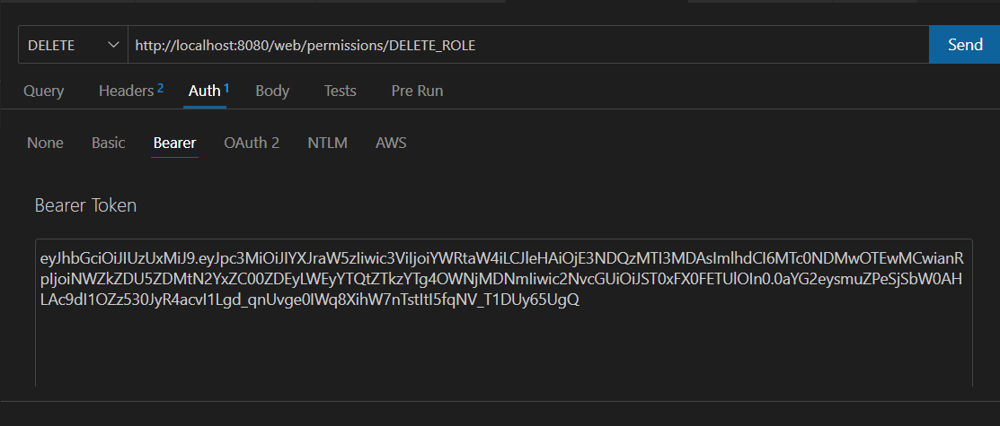
* Output: 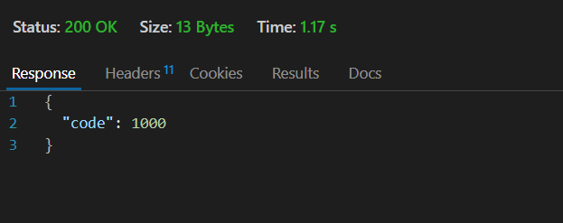
12. Check Login Token
* Input: 
* Output:
  * True Token: 
  * False Token: 
13. Logout
* Input:
* Output:
14. Delete User
* Input: 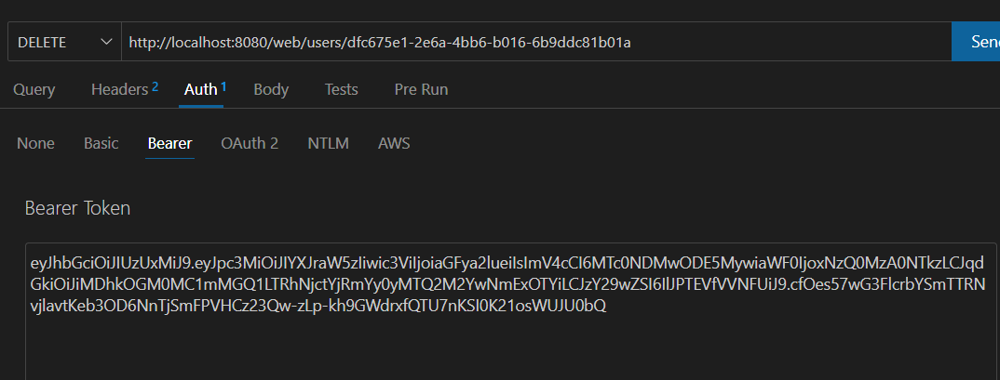
* Output: 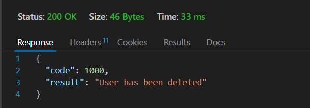

